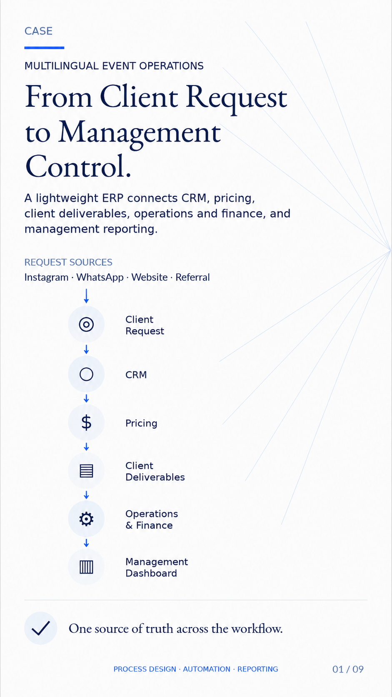
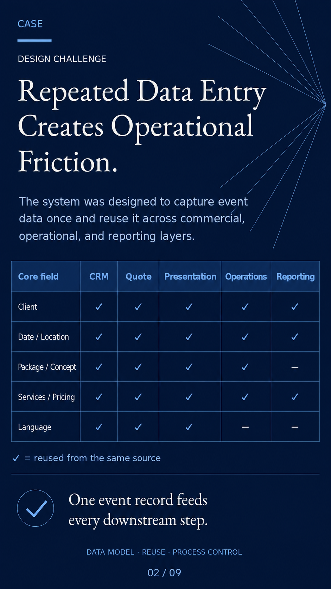
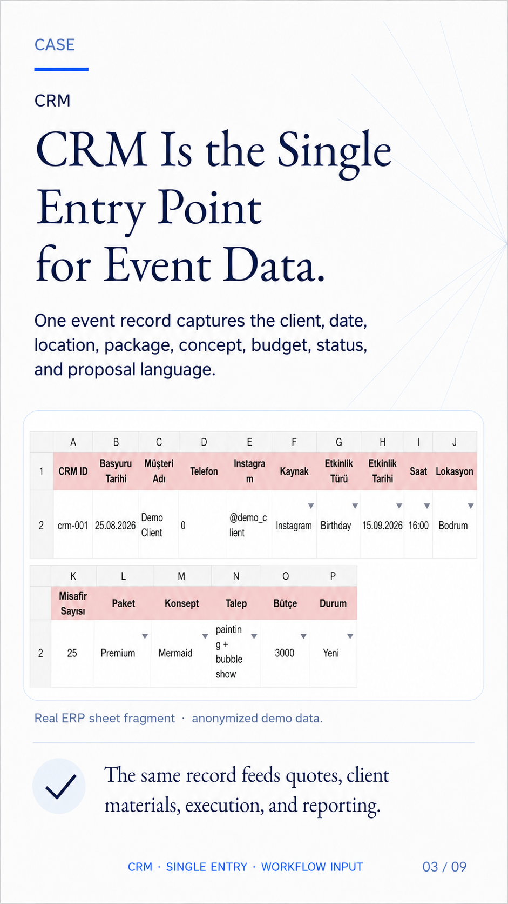
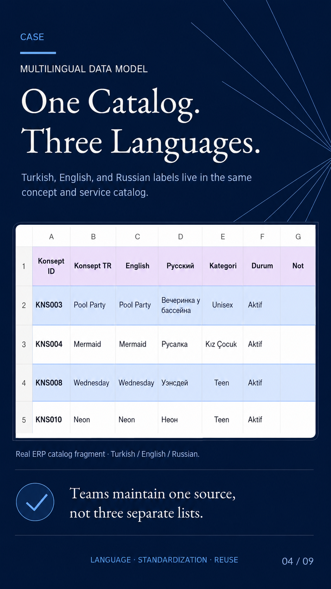
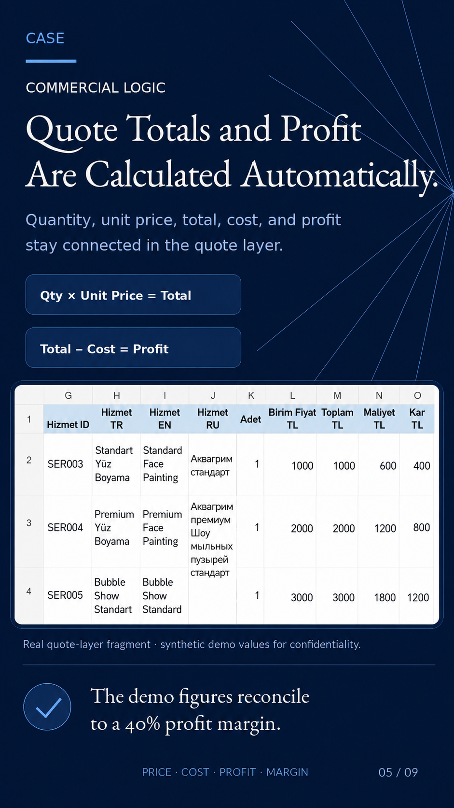
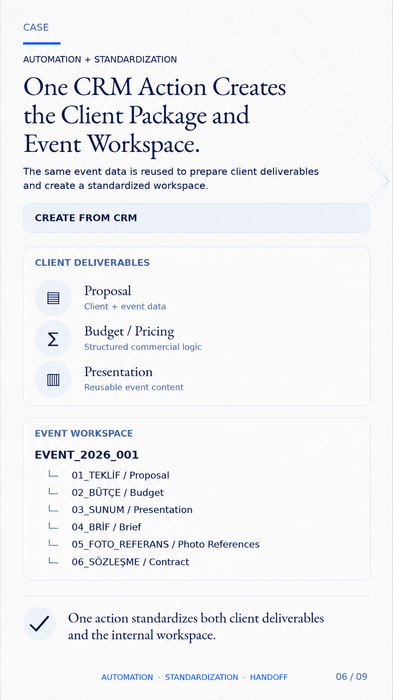
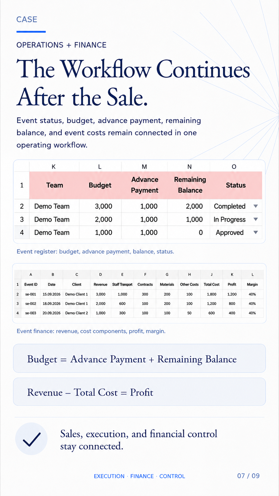
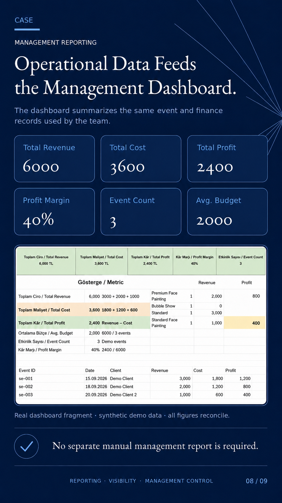
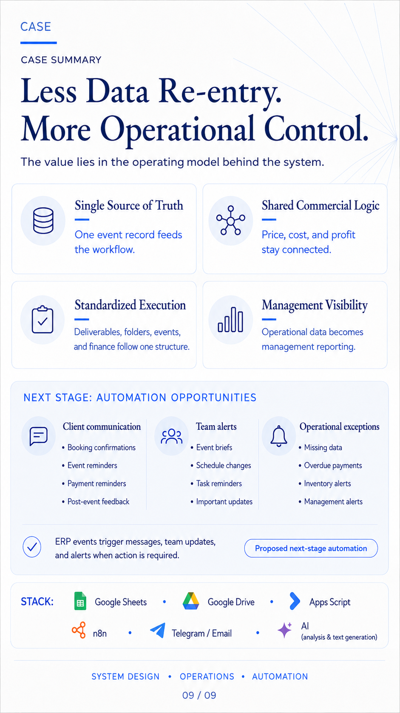

# Lightweight ERP Workflow for Event Operations

Portfolio case study: a lightweight ERP workflow that connects CRM, pricing, client deliverables, operations, finance, and management reporting through one event record.

## Problem

What happens when the same client and event information has to be entered five times?

A request comes through Instagram, WhatsApp, a website form, or a referral. The same event details then have to be copied into a CRM sheet, a quote, a client presentation, operational files, financial tables, and management reporting.

This creates a common operational problem:

- repeated manual data entry;
- multiple versions of the same event information;
- higher risk of errors when details change;
- extra coordination work between commercial and operational teams;
- limited management visibility across sales, execution, and finance.

The core design challenge was not only to make a spreadsheet cleaner. It was to define a workflow where one event record could become the source of truth for downstream business operations.

## Solution

I designed a lightweight ERP workflow around one principle:

> Capture once, reuse downstream.

One CRM event record becomes the entry point for the system. From there, the same structured data supports client-facing materials, commercial calculations, operational handoff, finance tracking, and management reporting.

## System Logic

| Layer | Role in the workflow |
| --- | --- |
| CRM | Captures the client request and core event data once. |
| Multilingual catalog | Keeps Turkish, English, and Russian labels connected to one concept or service. |
| Commercial logic | Calculates quote totals, costs, profit, and margin from reusable service data. |
| Client deliverables | Reuses event data for proposals, budgets, presentations, and briefs. |
| Operations | Keeps event status, schedule, package, team, and workspace structure connected. |
| Finance | Tracks budget, advance payment, remaining balance, revenue, costs, and profit. |
| Management reporting | Summarizes operational and financial data without a separate manual report. |
| Next-stage automation | Identifies follow-up opportunities for alerts, reminders, and client communication. |

## Design Principles

- Single source of truth for each event.
- Standardized data structure across CRM, quoting, operations, and reporting.
- Reusable multilingual catalog instead of separate language-specific lists.
- Connected commercial logic for price, cost, profit, and margin.
- Management visibility built from the same data used by the team.
- Automation added where it reduces coordination work, not for its own sake.

## Portfolio Evidence

The following nine cards are the final English LinkedIn version of this portfolio case. They are included here as the visual master reference for the workflow.

| Card | Focus |
| --- | --- |
| 01 | Overall workflow from client request to management control |
| 02 | Repeated data entry as the design challenge |
| 03 | CRM as the single entry point for event data |
| 04 | Multilingual data model for concept and service catalogs |
| 05 | Commercial logic for quote totals and profit |
| 06 | Automation and standardization of client packages and event workspaces |
| 07 | Operations and finance tracking after the sale |
| 08 | Management reporting fed by operational data |
| 09 | Case summary and next-stage automation opportunities |

### 01. Workflow Overview

### 02. Design Challenge

### 03. CRM Entry Point

### 04. Multilingual Data Model

### 05. Commercial Logic

### 06. Automation and Standardization

### 07. Operations and Finance

### 08. Management Reporting

### 09. Summary and Next-Stage Automation

## Business Impact

The workflow reduces duplicated manual work and keeps event information consistent across commercial, operational, financial, and reporting layers.

In practice, the business value comes from:

- less repeated data entry;
- fewer places to update when event details change;
- clearer handoff between sales and operations;
- connected pricing, cost, profit, and payment tracking;
- management reporting based on live operating data;
- a cleaner foundation for future automation.

## Tools and Stack

- Google Sheets
- Google Drive
- Apps Script
- n8n
- Telegram / Email
- AI-assisted analysis and text generation

## Scope and Privacy

This repository is a portfolio case study, not a public release of a live ERP system or client database.

The visual materials use anonymized or synthetic demo values where business-sensitive details would otherwise appear. Personal client information, confidential business data, private credentials, internal files, and production automation secrets are not included.

See [Privacy and Scope](docs/privacy-and-scope.md) for the repository safety boundary.
